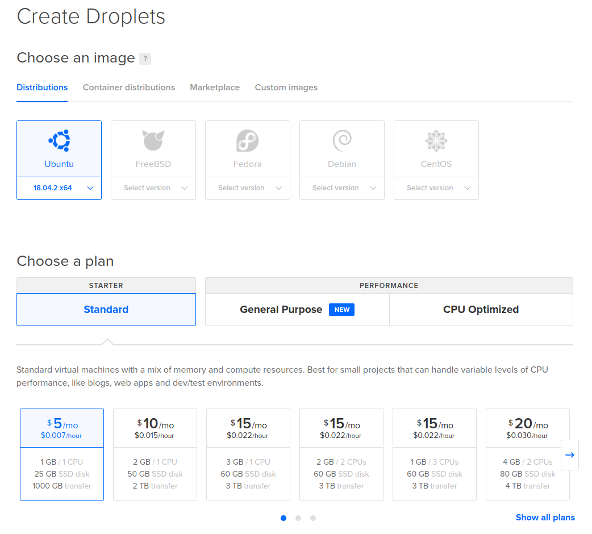
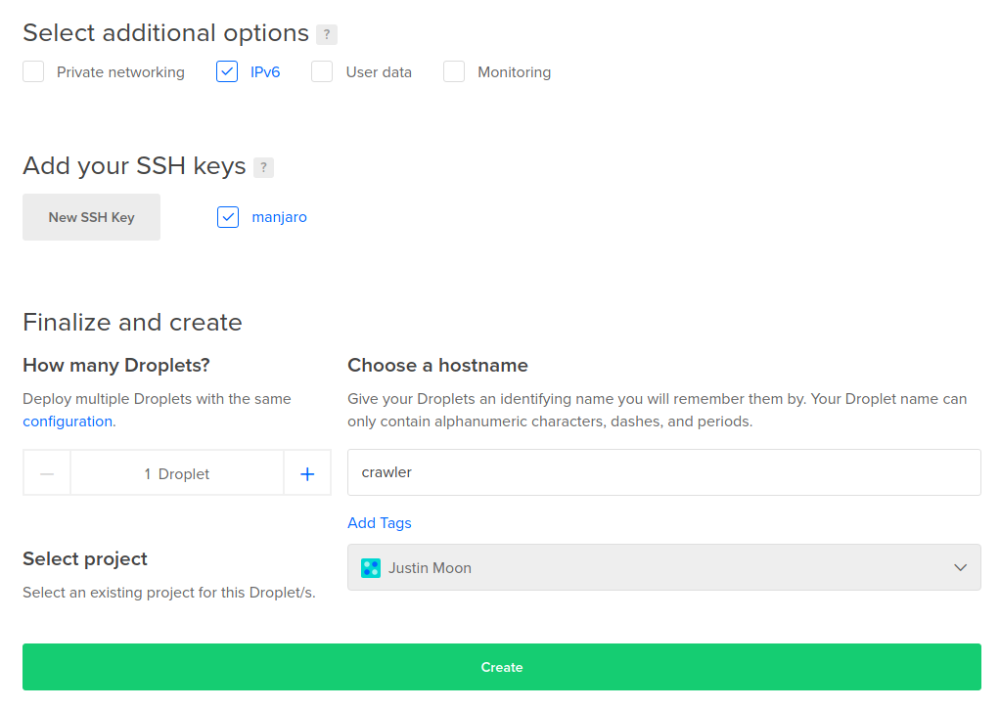
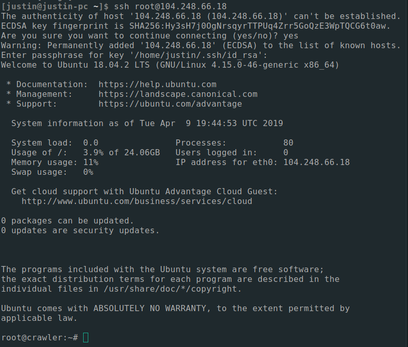

# A Bitcoin crawler + DNS seed

### Local Setup

```shell
python3 -m venv venv
source venv/bin/activate
pip install -r requirements.txt
```

Install Tor (optional, operating system dependent)

Run it with

```
python crawler.py
```

### Deploy to $5/month Ubuntu Digital Ocean Droplet

Create a "droplet". Choose "ubuntu" operating system and $5/month droplet size.



Tick the "IPv6" option and add your SSH key in order to more easily access this server. [Here's a guide to SSH keys on Digital Ocean if you aren't familiar with them](https://www.digitalocean.com/docs/droplets/how-to/add-ssh-keys/). Also, give your server a name like "crawler".



You'lll be redirected to a page listing your droplets. Click on the crawler instance and then click "ipv4" to copy the ip address to your clipboard. Navigate to your terminal and ssh into the droplet:



Update system, clone project install dependencies, run Tor

```
sudo apt update
sudo apt install python3-pip tor
git clone https://github.com/justinmoon/crawler.git
cd crawler
pip3 install -r requirements.txt
```

Run Tor & Check that it is running
```
$ sudo systemctl start tor
$ curl --socks5 localhost:9050 --socks5-hostname localhost:9050 -s https://check.torproject.org/ | cat | grep -m 1 Congratulations | xargs
Congratulations. This browser is configured to use Tor.
```

[Raise open file limits](https://medium.com/@muhammadtriwibowo/set-permanently-ulimit-n-open-files-in-ubuntu-4d61064429a). Without this you would run out of file descriptors for all the sockets the crawler creates. If you ever see "too many open files" Python errors, this is your problem.


Run crawler

```
# Run in foreground:
python3 crawler.py

# Run in background:
nohup python3 crawler.py &
```

You should get a `crawler.log` file which captures `logging` module outputs. When you run in background as described above, you should also get a `nohup.out` file that captures the print statements in the crawler.


### Querying the Database

```
sudo apt install sqlite3
```

Run queries in the sql folder:

```
sqlite3 crawler.db < sql/active-nodes-various-timeframes.sql
```

### Prior Art

- Peter Wuille's [bitcoin-seeder](https://github.com/sipa/bitcoin-seeder)
- [Bitnodes](https://github.com/ayeowch/bitnodes)

